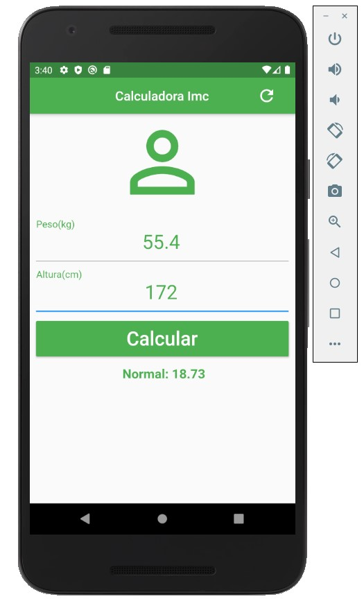

# Calculadora de IMC

Projeto feito totalmente em flutter, framework da linguagem dart.


## **Intuito**

O intuito do projeto era exercitar o conteúdo já aprendido nos primeiros módulos do curso **[Criação de Apps Android e iOS com Flutter - Crie 16 Apps](https://www.udemy.com/course/curso-completo-flutter-app-android-ios/?couponCode=FLUTTER12192)** do professor Daniel Ciolfi.

------

------

### **Explicação App**

O aplicativo tem por finalidade fazer o cálculo do IMC ( Índice de Massa Corpórea) de uma pessoa. Parâmetro adotado pela Organização Mundial de Saúde para calcular o peso ideal de cada pessoa.

A seguir como é feito o cálculo, segundo o site [programasaudefacil.com.br](https://www.programasaudefacil.com.br/calculadora-de-imc):

> O índice é calculado da seguinte maneira: divide-se o peso do paciente pela sua altura elevada ao quadrado. Diz-se que o indivíduo tem peso normal quando o resultado do IMC está entre 18,5 e 24,9.


### Interpretação do IMC

|        IMC        |  Classificação  | Obesidade (grau) |
| :---------------: | :-------------: | :--------------: |
|  MENOR QUE 18,5   |     MAGREZA     |        0         |
| ENTRE 18,5 E 24,9 |     NORMAL      |        0         |
| ENTRE 18,5 E 24,9 |     NORMAL      |        0         |
| ENTRE 25,0 E 29,9 |    SOBREPESO    |        I         |
| ENTRE 30,0 E 39,9 |    OBESIDADE    |        II        |
|  MAIOR QUE 40,0   | OBESIDADE GRAVE |       III        |

> Informações da tabela obtidas atrás do site: **[programasaudefacil.com.br](https://www.programasaudefacil.com.br/calculadora-de-imc)**.


### **Explicação Código**

### **Variáveis**

Agora terá explicação das variáveis utilizadas.

* `TextEditingController _weightController = TextEditingController()`: variável controladora atrelada ao TexFormField, para pegar o valor digitado n campo de **Peso(Kg)**.
* `TextEditingController _heightController = TextEditingController()`: variável controladora atrelada ao TexFormField, para pegar o valor digitado n campo de **Altura(cm)**.
* `String _info = "Digite suas informações !"`: variável do tipo string que irá cuidar da mensagem apartir das informações digitadas pelo usuário.
* `GlobalKey<FormState> _formKey = GlobalKey<FormState>()`: uma Key para atrelar ao form.
* `double weight = double.parse(_weightController.text)`: variável do tipo double para transformar o texto pego pelo controller `_weightController ` em um tipo double.
* ` double height = double.parse(_heightController.text) / 100`: variável do tipo double para transformar o texto pego pelo controller `_heightController ` em um tipo double e dividir por 100 já que o valor é pego em metros eé necessário a conversão para centímetros.
* `double imc = weight / (height * height)`:  variável double que fará a parte da equação explicada anteriormente.
* 


### **Método**s

Agora terá explicação dos métodos utilizados para controle do aplicativo.

**Método de resetear**:   

```
void _reset() {
    _weightController.text = "";
    _heightController.text = "";

    setState(() {
      _formKey = GlobalKey<FormState>();
      _info = "Digite suas Informações";
    });
  }
```

> Esse método foi criado para o botão de reset que tem na **appBar** , onde fará a limpeza dos campos de inputs, e da informação dada com os dados anteriores.

**Método de calcular**:

```
void _calculate() {
    setState(() {
      double weight = double.parse(_weightController.text);
      double height = double.parse(_heightController.text) / 100;
      double imc = weight / (height * height);

      if (imc < 18.5) {
        _info = " Magreza: ${imc.toStringAsPrecision(4)}";
      }else if (imc > 18.5 && imc < 24.9) {
        _info = " Normal: ${imc.toStringAsPrecision(4)}";
      }else if(imc > 25 && imc < 29.9) {
        _info = " Obesidade I: ${imc.toStringAsPrecision(4)}";
      }else if(imc > 30 && imc < 39.0) {
        _info = " Obesidade II: ${imc.toStringAsPrecision(4)}";
      }else if(imc > 40) {
        _info = " Obesidade III: ${imc.toStringAsPrecision(4)}";
      }else {
        _info = "Digite suas Informações";
      }
    });
  }
```

> No método de calcular é feita a criação das variáveis explicadas anteriormente, pois será necessário elas para que seja feito a equação, e verificação de cada resultado, para assim dar a informação ao usuário, na qual taxa ele se encontra do **IMC**.


## **Widgets Utilizados**

Agora será mostrado os widgets do flutter que foram utilizados para compor essa simples aplicação:

* **Scalffold**: utilizado para fazer a appBar e desenvolvimento da base do aplicativo.
* **AppBar**: utilizado para a definição do nome e da barra do aplicativo.
* **Flat Button**: utilizado para fazer o botão de resetear.
* **Icon**: utilizado juntamente com o Flat Button para atribuição do botão, deixando com uma iconografia reconhecida pelas pessoas.
* **SingreChildScrollView**: utilizado para que se precisasse de mais espaço, houvesse um scroll, não impedindo o usuário de ver as informações.
* **Form**: utilizado para fazer o formulário e as verificações.
* **Padding**: utilizado para o espaçamento de cada item.
* **Column**: utilizado para o posicionamento dos elementos na tela.
* **TextFormField**: utilizado para fazer os input.
* **Container**: utilizado para dar espaçamento ao botão **Calcular**.
* **Raised Button**: utilizado para o botão calcular e atribuir função a ele.
* **Text**: utilizado para o txto das informações abaixo do botão **calcular**.


# **Print da Aplicação**

Agora será mostrado como ficou a aplicação, utilizando layout passado pelo professor Daniel:



****
****

# Autor

> Marlon Symczecym

**Agradeço por terem acompanhdo o post todo e a explicação, e trarei mais projetos.**

